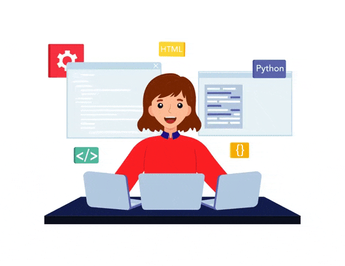

# Portfolio

Welcome to my portfolio! I am a student currently enrolled in a blockchain architect program, and this portfolio showcases my work, projects, and skills as I advance in my studies.

## About Me

I am a student with a keen interest in blockchain technology and software development. My education has provided me with a strong foundation in both frontend and backend development, and I have practical experience working with the MERN stack (MongoDB, Express.js, React, Node.js). I am eager to apply these skills in innovative projects and explore new opportunities.

## Purpose

The purpose of this portfolio is to present the projects I have worked on, the skills I have acquired, and the technologies I am passionate about. It serves as a platform to demonstrate my growth and capabilities as I continue my studies and pursue further learning and development.

## Projects

In the "Projects" section, you will find a variety of projects showcasing different aspects of my work:

- **KBA Course App**: A web application showcasing blockchain-related courses.
- **AssetPro**: An IT asset management tool designed for efficient tracking and management.
- **CookBook**: A recipe book featuring a collection of delicious and easy-to-make dishes.
- **Electricity Bill Management System**: A system for managing and tracking electricity bills.
- **Blog App**: A platform for creating and managing blog posts.
- **Employee Management App**: An application for managing employee information and records.

Each project includes a brief description, a link to the code repository, and an image to give you a visual sense of the project.

## Skills

In addition to the projects, you’ll find information about the skills and technologies I’ve worked with, including:

- **Frontend Development**: React, HTML, CSS, Tailwind CSS
- **Backend Development**: Node.js, Express.js
- **Database Management**: MongoDB
- **Version Control**: Git, GitHub
- **Deployment**: Docker, Heroku, Vercel

## Navigation

Feel free to explore the different sections of my portfolio:

- **Projects**: View detailed information about each project.
- **Skills**: Learn about the technologies and tools I am proficient in.
- **Contact**: Reach out if you’d like to discuss opportunities or collaborate.

## Contact


## Getting Started

### Prerequisites

Make sure you have the following installed:

- [Node.js](https://nodejs.org/)
- [npm](https://www.npmjs.com/) 

### Installation

1. Clone the repository:

   ```bash
   git clone https://github.com/Neethu_Muthu/NEETHU_PROTFOLIO_USING_REACT.git
   ```

2. Navigate to the project directory:

   ```bash
   cd portfolio
   ```

3. Install the dependencies:

   ```bash
   npm install
   ```

### Running the Project

To start the development server, run:

```bash
npm start
```


The website will be available at `http://localhost:3000`.

## Contributing

Contributions are welcome! Please fork the repository and create a pull request with your changes.
